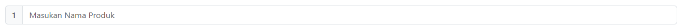
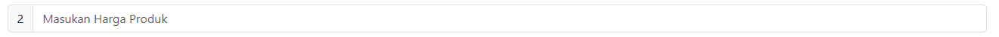
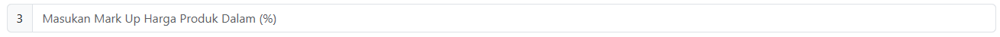
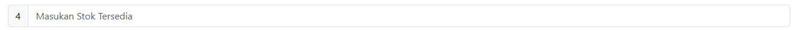
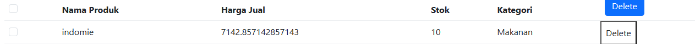
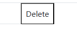

# Membuat Transaksi Tambah Produk Menggunakan Typescript

## Fitur

### Input Nama Produk

### Input Harga Pokok Produk

### Input Mark Up (%) Sebagai Keuntungan Yang Menghasilkan Output Harga Jual Secara Otomatis

### Input Stok Produk Tersedia

### Select Kategori Produk

### Fitur Button Untuk Menampilkan Detil Produk Sebagai Hasil Dari Input User dalam Bentuk Tabel

### Fitur Delete Produk

